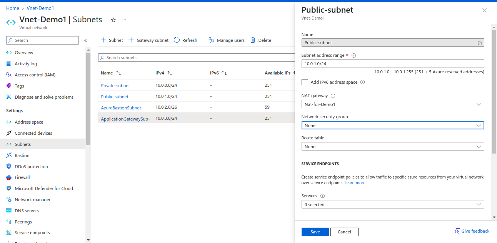
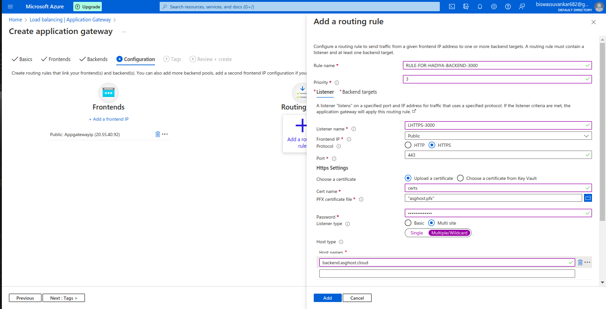

# Hosting (Hadiya) Nodejs Application on VM (Private) keeping DB as Paas service and Exposing Application Publicly using Azure Application Gateway.

| Revision | Change | Date | Author | Approver |
| --- | --- | --- | --- | --- |
| 0.1 | Initial Release |  | Abhishek S. | Shoaib S. |

---

## Objective

We will look how to host nodejs application in private vm and configuring NAT in public subnet and create Route Table and attach to private subnet to send outbound Traffic to internet using NAT and expose application publicly using Azure Application Gateway.

## Overview and  imp services
- <ins>Hadiya Products</ins>: It is E-commerce application(Nodejs) which is having angular Framework in Frontend and express.js in backend and mysql DB.
Important  file in frontend code <ins> environment.prod.ts </ins>   which require backend URL to connect backend. In Backend code important file is <ins>.env</ins> in which we have to paste connection string of database to communicate with DB.
- <ins>NAT</ins> : NAT is used to provide outbound Internet connectivity for resources in a virtual network, without assigning public IP addresses directly to those resources 
- <ins>Route Table</ins> : It is for directing outbound traffic from internal resources to the NAT Gateway for Network Address Translation before it reaches the Internet.
- <ins>Azure Bastion</ins>: To connect to Private Vm using microsoft backbone Network

- <ins>Azure Application Gateway</ins>: It works on L7 of OSI (Open system Intercommunication) Model, It is similar to Nginx. It is commonly used for Host/Domain based and Path based routing and It is regional service.
  
## Resources or Services to be created in Azure

- Azure Resource Group
- Azure VNET with 4 subnets
     - Public subnet
     - Private Subnet
     - subnet for Bastion Host (Jump Host)
     - Subnet for Application Gateway
 - Azure VM (Private i.e without public IP address)
 - Azure NAT
 - Mysql DB
 - Azure Application Gateway    

#### Resource Group
- Overview: Resource Group is a group of azure resources like virtual machines, app services, storage accounts, SQL databases etc. It's a logical container for grouping related azure resources.

#### Steps to create VNET and subnets
- Overview : <ins>Virtual Network</ins> is a service that provides the fundamental building block for your private network in Azure. An instance of the service (a virtual network) enables many types of Azure resources to securely communicate with each other, the internet, and on-premises networks
<ins>Subnets</ins> enable you to segment the virtual network into one or more subnetworks and allocate a portion of the virtual network's address space to each subnet

- Select Subscriptions, RG, Region
- Skipped Security Tab for simplicity

-  IP addresses TAB is for Creation of Public, Private, AzureBastionSubnet, Application Gateway subnet
- Below is the creation of private subnet and same procedure for creation of  public subnet and application subnet, And changes related to the NAT will be shown further.

- Below is the bunch of subnets needed with their respective IP addresses ranges
- <ins>Note</ins>: Name of bastion subnet should be AzureBastionSubnet as per Azure official Document.
- In next Tab you can add Tags as per your company, product and environmnent and Click on review and create

#### Steps to create NAT
- Search for NAT in search box and click on it.
- Below is the Basic Tab of the Nat 
- Imp is to select the Availabilty Zone of the Nat.
- Imp Choose an availability zone for this NAT gateway. If you have other resources that you plan to use with this NAT gateway it’s recommended that you match the zone of those resources. means the resources you created should have zone match with NAT

- Below img shows the Outbound Tab for the IP address of the NAT for communicating to internet.

  
- Below is the subnet Tab and select the Public subnet and your Nat will resides in that subnet.
- And then select Review+create options

- Below is the Insights of the Nat with Public ip attach to the Nat and Nat resides in Public subnet.

#### Steps to create Route Table
- search for route Table and select respective resource group, Region, Name and click on review+create

-  Click on Created Route Table select Routes and create route configuration 
- - Destination : The destination field in a route table entry allows you to define the set of IP addresses to which the route applies you can add ip address or Subnet range
- - Next Hop Type : It specifies how the traffic should be forwarded to reach the specified destination in our case i have used Nat 
- - Next Hop Address : It specifies the IP address of the next hop when the Next Hop Type is Virtual Appliance or IP address
- The below configuration says that the ip address or CIDR range is source that means the outbound traffic is from the vms or resources which resides in that subnet/CIDR range mentioned, The Next hop type is virtual appliance in our case it is Nat, Traffic from our private vm is reached to nat with the help of Next Hop Address i.e is the public of NAT.The NAT Gateway translates the source IP address of the outbound traffic from the private IP address of the VM to its public IP address.
This is done to ensure that the response from the Internet is correctly routed back to the NAT Gateway

- Attach NAT and NSG to Public Subnet 

- Attach RouteTable and NSG to Private Subnet 

#### Steps to create Application Gateway

- Search for Application Gateway in search box and click it 
- Select and click on the following check box
- - Subscriptions
- - Resource group
- - Application Gateway Name
- - Region 
- - Tier
- - Enable Autoscaling (No)
- - Availability Zone same as Nat (For simplicity we have kept Nat, private vm and application Gateway in same zone)
- - Vnet
- - Subnet 

- In the Frontend Tab create Frontend IP for expose it publicily

- In The Backend Tab Add backend pool
- A backend pool can contain virtual machines, virtual machines scale sets, IP addresses, domain names, or an App Service.It is Similar to the Target Group in AWS Application Loadbalancer
- Write the name of Backend pool, IP address(private) of vm in our case 

- Below says  In configuration Tab Add routing rule for backend nodejs application running on port 3000 first for simplicity 
- Below conf says that create Rule First in our case we have create rule for backend application.
-  Rule is associate to Listener so we have created Listener with name LHttps-3000 which recieve request from client/Browser by Protocol Https and on port 443
- So we have click on Protocol Https and Port 443 
-  so After That we have uploaded pfx certificate from local 
- After that we have selected multi site and in that multiple/wildcard because we have multiple subdomain used in our website of same parent domain.
- In Host Type i have written domain of backend application i.e backend.asghost.cloud

- Above configuration says that client/browser requests for backend.asghost.cloud domain using https protocol and 443 port forward request to BE pool (Target Group in AWS)where our target type resides in our is vm Show below
  

- Backend Settings says when requests come from https://backend.asghost.cloud to application gateway ssl Termination occurrs on face of application gateway and request is forward to BE pool where my application is running on port 3000 and my application will talk with application gateway using http protocol in below image 

- Add Tags and Click on Review+Create for Frontend we will create Rules and Listener after Application Gateway is created.

- Creation of Listener and Rule For Frontend when application Gateway recieves request on www.asghost.cloud using https protocol and 443 port.

- Creation of Backend setting for FE 

- Creation of Rule for Https request to FE.

- Above configuration says when request comes to application gateway on https forward to backend pool on Backend setting BS-80 where my Frontend application is running and nginx is up in my VM

- Now Configure Rule and Listener for Redirection, Means when client/Browser hits request for url or application it first uses http protocol and port 80 so we have to redirect to https to make our site secure 
- Listener Http for FE
- 
  
- Redirection Rule For FE

- Overview of Listeners.

- Overview of Rules.

- Insights of Application Gateway

#### OUTPUT

### IMP 
Add Application gateway ip address as A Record in DNS in our case Go daddy
   
### Routing Architecture and calling of Application Gateway   

